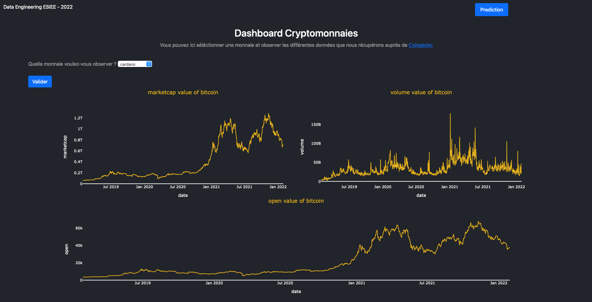
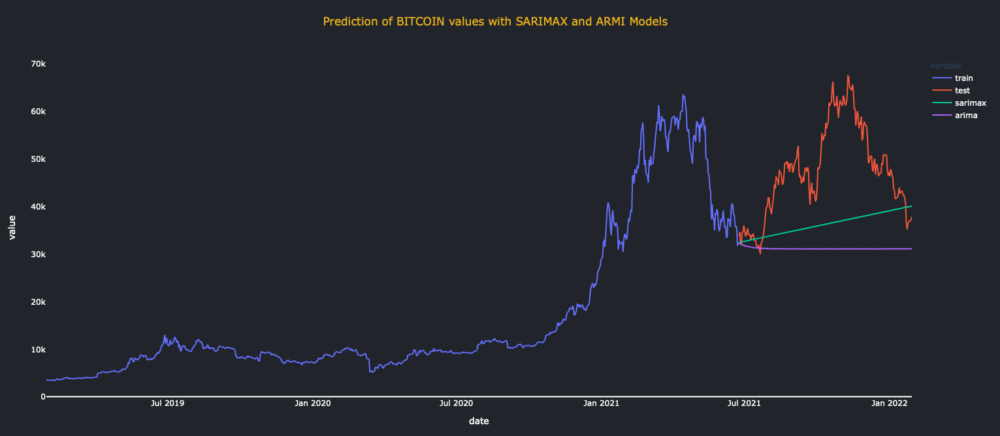

[![Contributors][contributors-shield]](https://github.com/juju312000/DataEngineerProject/graphs/contributors)
[![LinkedIn_juju][linkedin-shield]](https://linkedin.com/in/jmarchadier)
[![LinkedIn_val][linkedin-shield]](https://linkedin.com/in/valentin-rebuffey-2b34aa22a)

# DataEngineerProject

## Table of contents
* [About the Projet](#About-the-Project)
* [Get Starting](#Get-Strating)
  * [Prerequisites](#Prerequisites)
  * [Build with](#Build-with)
  * [Installation](#Installation)
  * [Run The Project](#Run-the-project)
* [Code Explanation](#Code-Explanation)
  * [CoinGecko.py](#Coingecko.py)
  * [Server.py](#Server.py)
* [Contact](#contact) 

## About The Project

This repository is a project of our second year of engineering study.
It took place in 1 month in DataEngineer course.

The goal is to create a web application based on Flask package.
This application should scrape data from website and print them (like with graphs).
Datas need to be stock on database seen in course.

So we decide to make an analysis of cryptocurrency and try to fit a model on daily values to predict trend.
To build this, we use [CoinGecko website](https://www.coingecko.com) to collect data from the most used crypto-currencies.
We stock them on MongoDB client.
After collecting all the data, we start a Flask server who show 3 graphics :

* <u>MarketCap</u>: represent the total value of cryptocurrency in circulation. It can be obtain by multiply cryptocurrency value by the number of cryptocurrency.


* <u>Volume</u> : represent the number of cryptocurrency in circulation.


* <u>Value</u> : represent the cost of a cryptocurrency at one given time

The second page (when you clic on "predict") will show you a big graph where 70% first values represent the value of the cryptocurrency and on 30% last values there are :

* <u> Blue </u> : first 70% values of cryptocurrency 


* <u> Red </u>  : last 30% values of cryptocurrency


* <u> Green </u> : Predict values bases on SAMIRAX model (This model is the basic interface for ARIMA-type models, including those with exogenous regressors and those with seasonal components)


* <u> Purple </u> : Predict values bases on AMIRA model (Seasonal AutoRegressive Integrated Moving Average)

To be deploy every where the application, we create a docker network with a docker compose to create 3 containers : MongoDB, PyScraping
and PyFlask.

##Getting Started
### Prerequisites

* <u>Docker</u> is install and update.


* Enough space (1,5 Go).

### Build with

* First docker image is base on [MongoDb image](https://hub.docker.com/_/mongo) on docker hub.


* Second docker image is build on [Python image](https://hub.docker.com/_/python) on docker hub. Specially the 3.7 version. To adapt this image :
  * we add usefully file on the work directory :
  ```bash
  RUN mkdir /app/ && mkdir /app/templates/

  WORKDIR /app/

  #Add importants files
  ADD templates/ ./templates/
  ADD requirements.txt .
  ADD CoinGecko.py .
  ADD server.py .
  ```
  * we install packages found in [requierement.txt](requirements.txt) by running the following command on the image: 
  ```bash
  pip install -r requirements.txt
    ```
  

### Installation 

To build our project, we need to create our 2 images with the following code on terminal :

```sh
  docker-compose up -d
  ```
This command will build an run the project directly.

### Run the project

To run the project, it's the same command than 'Installation' : 
```sh
  docker-compose up -d
  ```

If not problem happen during previous step, you can open your web browser and looking for [this website](http://localhost:5001/) on your localhost ip on port 5001.

Some think like that should appear : 



To see the trend of our prediction, clic on the button "Predict" on Left Up of the screen.
Some think like that should appear :



## Code Explanation 
### [CoinGecko.py](CoinGecko.py)

This python code executed on our python3.7 image, is our scraping process. 
We use [BeautifulSoup](https://www.crummy.com/software/BeautifulSoup/) to scrape data on coingecko website.
First we name all crypto that we want get data from.

```python
jsonCryptoName = {"btc": "bitcoin", "eth": "ethereum", "bnb": "binance-coin", "ada": "cardano", "sol": "solana"}
```
We build links of depend of crypto between 2 dates: 
```python
links = allLinks(jsonCryptoName, [str(datetime.now().date()), "2019-01-28"])
```
We start MongoDb connection :
```python
client = MongoClient("mongo", 27017)
db = client["coingecko"]
 ```

The main part can start by running the scraping function :
```python
scrapingAll(jsonCryptoName, links)
```
This function find data and put them in the right form in MongoDB
```python
for i in range(len(data) // 4):
    coll.insert_one({"date": data_dates[i], "marketcap": data[(i * 4)], "volume": data[(i * 4) + 1],"open": data[(i * 4) + 2],"close": data[(i * 4) + 3]})
```

Once all data is put in the database, the container shut down.

### [Server.py](server.py)

This code executed on our python3.7 image, is our Flask server to representing datas.

In the same way, we start by connecting to MongoDB, secondly we run the server Flask :
```python
app = Flask(__name__, template_folder='./templates')
app.run(host='0.0.0.0', port=5001, use_reloader=False)
```

There are 2 main pages :

* Graphics page 
    ```python
    @app.route("/graph/<crypto>", methods=['GET', 'POST'])
    ```
  This page show 3 graphics in function of cryptocurrency parameter. By default it's Bitcoin.

* Predict page 
    ```python
    @app.route("/graph/<crypto>/predict", methods=['GET', 'POST'])
    ```
  When this page is loaded, 2 models are trained and produce trend. They appear on graphic.
    ```python
    # 1er model
    ARMAmodel = SARIMAX(y_train, order=(3, 2, 3))
    ARMAmodel = ARMAmodel.fit(disp=0)

    y_pred_sarimax = ARMAmodel.get_forecast(len(test_set))
    y_pred_df_sarimax = y_pred_sarimax.conf_int(alpha=0.05)
    y_pred_df_sarimax["Predictions"] = ARMAmodel.predict(start=y_pred_df_sarimax.index[0],
                                                         end=y_pred_df_sarimax.index[-1])
    y_pred_df_sarimax.index = test_set["date"]
    y_pred_out_sarimax = y_pred_df_sarimax["Predictions"]
    y_pred_out_sarimax.index = range(train_size, len(df))
    df["sarimax"] = y_pred_out_sarimax

    # 2ème model
    ARIMAmodel = ARIMA(y_train, order=(4, 1, 3))
    ARIMAmodel = ARIMAmodel.fit()

    y_pred_arima = ARIMAmodel.get_forecast(len(test_set["date"]))
    y_pred_df_arima = y_pred_arima.conf_int(alpha=0.05)
    y_pred_df_arima["Predictions"] = ARIMAmodel.predict(start=y_pred_df_arima.index[0], end=y_pred_df_arima.index[-1])
    y_pred_df_arima.index = test_set["date"]
    y_pred_out_arima = y_pred_df_arima["Predictions"]
    y_pred_out_arima.index = range(train_size, len(df))
    df["arima"] = y_pred_out_arima
    ```
    By default the cryptocurrency used is Bitcoin but you can change it in the same way as home page.


## Contact

Marchadier Julien - julien.marchadier@edu.esiee.fr

Rebuffey Valentin - valentin.rebuffey@edu.esiee.fr

Project Link: [https://github.com/juju312000/DataEngineerProject](https://github.com/juju312000/DataEngineerProject )

<!-- MARKDOWN LINKS & IMAGES -->
[contributors-shield]: https://img.shields.io/github/contributors/juju312000/DataEngineerProject.svg?style=for-the-badge
[linkedin-shield]: https://img.shields.io/badge/-LinkedIn-black.svg?style=for-the-badge&logo=linkedin&colorB=555
